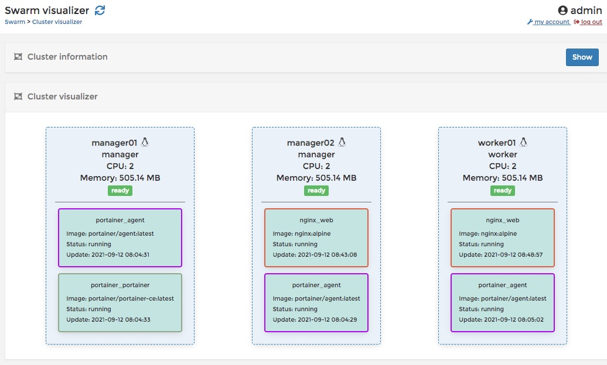
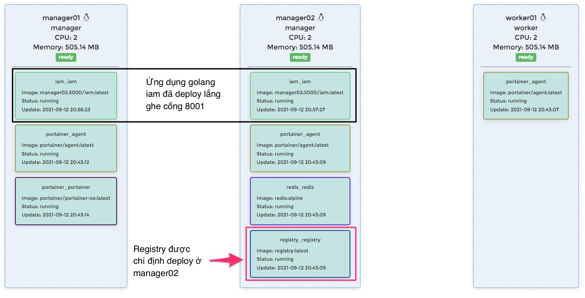

Tham khảo [Learn Docker Swarm with Vagrant](https://levelup.gitconnected.com/learn-docker-swarm-with-vagrant-47dd52b57bcc)
## Khởi tạo 3 máy ảo
```
$ vagrant up
```

## Thực hành trên `manager01`
1. SSH vào manager01
    ```
    $ vagrant ssh manager01
    ```

2. Hãy kiểm tra ip của nó có đúng là `192.168.33.2` không
    ```
    $ ifconfig
    eth1: flags=4163<UP,BROADCAST,RUNNING,MULTICAST>  mtu 1500
      inet 192.168.33.2  netmask 255.255.255.0  broadcast 192.168.33.255
      inet6 fe80::20c:29ff:fe4e:3e01  prefixlen 64  scopeid 0x20<link>
      ether 00:0c:29:4e:3e:01  txqueuelen 1000  (Ethernet)
      RX packets 20362  bytes 4847911 (4.8 MB)
      RX errors 0  dropped 0  overruns 0  frame 0
      TX packets 19272  bytes 4830880 (4.8 MB)
      TX errors 0  dropped 0 overruns 0  carrier 0  collisions 0
    ```
3. Khởi tạo Docker Swarm
    ```
    $ docker swarm init --listen-addr 192.168.33.2:2377 --advertise-addr 192.168.33.2:2377

    To add a worker to this swarm, run the following command:
    docker swarm join --token SWMTKN-1-1t4mi73lltrxg3ipxxoxh1v0ofe6knlmis81qezkngp62gyzmk-8zeuc96e7ah5lh8f8kbfi0nzn 192.168.33.2:2377

    To add a manager to this swarm, run 'docker swarm join-token manager' and follow the instructions.
    ```

5. Gõ lệnh dưới đấy để lấy token tạo manager tiếp theo
    ```
    $ docker swarm join-token manager

    To add a manager to this swarm, run the following command:

    docker swarm join --token SWMTKN-1-1t4mi73lltrxg3ipxxoxh1v0ofe6knlmis81qezkngp62gyzmk-7a0jkvzldoigbtyl1vezzh0xp 192.168.33.2:2377
    ```

## Thực hành trên manager02

1. SSH vào manager02
   ```
   $ vagrant ssh manager02
   ```
2. Gõ lệnh để join docker swarm dưới role manager
   ```
   docker swarm join --token SWMTKN-1-1t4mi73lltrxg3ipxxoxh1v0ofe6knlmis81qezkngp62gyzmk-7a0jkvzldoigbtyl1vezzh0xp 192.168.33.2:2377
   ```

## Thực hành trên worker01
1. SSH vào worker01
   ```
   $ vagrant ssh worker01
   ```
2. Gõ lệnh để join docker swarm dưới role worker
   ```
   docker swarm join --token SWMTKN-1-1t4mi73lltrxg3ipxxoxh1v0ofe6knlmis81qezkngp62gyzmk-8zeuc96e7ah5lh8f8kbfi0nzn 192.168.33.2:2377
   ```


## Liệt kê các node trong docker swarm
```
$ docker node ls
ID                            HOSTNAME    STATUS    AVAILABILITY   MANAGER STATUS   ENGINE VERSION
6dijd48m3lcmk99835342n7om *   manager01   Ready     Active         Leader           20.10.7
76cyxv9mp1wmpa2bhn97mkn6k     manager02   Ready     Active         Reachable        20.10.7
ihiwerjs86p7uv3czx7x91obl     worker01    Ready     Active                          20.10.7
```

## Quay lại manager01 cài Portainer

1. SSH vào manager01
    ```
    $ vagrant ssh manager01
    ```
2. Gõ lệnh này sau đây để lấy file `portainer-agent-stack.yml`
   ```
   $ curl -L https://downloads.portainer.io/portainer-agent-stack.yml -o portainer-agent-stack.yml
   ```
3. Gõ lệnh này tiếp theo để triển khai stack
   ```
   $ docker stack deploy -c portainer-agent-stack.yml portainer
   ```

## Điều khiển portainer qua http://localhost:9000

Do file [Vagrantfile](Vagrantfile) cấu hình forwarded_port '9000'
```ruby
if i == 1  # Server Manager đầu tiên của Docker Swarm
  #Only configure port to host for Manager01
  manager.vm.network :forwarded_port, guest: 8080, host: 8080
  manager.vm.network :forwarded_port, guest: 5000, host: 5000
  manager.vm.network :forwarded_port, guest: 9000, host: 9000
end
```

Giờ bạn chỉ cần vào `http://localhost:9000` là thấy được giao diện của Portainer

## Thực hành xong thì tạm thời dừng

Gõ lệnh
```
$ vagrant halt
```

Khi nào cần dùng lại
```
$ vagrant up
```

## Deploy Nginx lên Portainer

```yaml
version: "3.8"

services:
  web:
    image: nginx:alpine
    ports:
    - "8001:80"
```


Xem Swarm Cluster


Mở trình duyệt tới địa chỉ http://localhost:8001

## Deploy WhoAmI

```yaml
version: "3.8"

services:
   whoami:
    image: containous/whoami:dev
    ports:
    - "5000:80"
```

## Deploy Redis
```yaml
version: "3.8"
services:
 redis:
    image: "redis:alpine"
    command: redis-server --requirepass abc123
    ports:
     - "6379:6379"
    environment:
     - REDIS_REPLICATION_MODE=master
```

## Deploy Docker Registry
Triển khai docker registry ở đúng node `manager02` xem lệnh `constraints: [node.hostname == manager02]`

```yaml
version: "3.8"
services:
 registry:
    image: "registry:latest"
    restart: always  
    ports:
     - "5000:5000"
    deploy:
      placement:
        constraints: [node.hostname == manager02]

```

## Cấu hình cho phép truy cập insecured Docker Registry
Docker Registry server mặc định yêu cầu HTTPs để phục vụ. Trong môi trường thử nghiệm Vagrant trên local, không bật được HTTPS thì chúng ta cấu hình kết nối vào insecured docker registry.

Kết nối SSH vào manager01
```
$ vagrant ssh manager01
```

Chuyển sang root rồi tạo file `/etc/docker/daemon.json`
```
$ sudo -i
$ nano /etc/docker/daemon.json
```

Thêm nội dung như sau
```json
{
    "insecure-registries" : [ "manager02:5000" ]
}
```

Cần đảm bảo file `/etc/hosts` đã chứa
```
192.168.33.2 manager01
192.168.33.3 manager02
192.168.33.4 worker01
```

Khởi động lại Docker daemon
```
$ sudo systemctl daemon-reload
$ sudo systemctl restart docker
```

Vào thư mục [src](src) gõ lệnh
```
$ docker build . -t iam:latest
$ docker run -d --name iam -p 8001:8001 iam:latest


$ docker image tag iam:latest manager02:5000/iam:latest
$ docker image push manager02:5000/iam:latest
```


## Deploy ứng dụng Golang trong máy ảo Vagrant
Hiện tại Vagrant tạo ra 3 máy ảo Ubuntu 18.x lần lượt là:
- manager01
- manager02
- worker01

Trong thư mục [/src](/src) lưu một dự án Golang đơn giản

Trong file [Vagrantfile](Swarm/Vagrantfile) có đoạn lệnh cấu hình như sau

```ruby
config.vm.synced_folder "./src", "/src"
```

Nó map thư mục [/src](/src) vào thư mục src của máy ảo. Có thể tuỳ biến synced_folder cho từng máy ảo một.

Xem chi tiết ở [src](src/ReadMe.md)

Sau khi đã push thành công `manager02:5000/iam:latest`

Thì tạo Stack với Docker-compose như sau

```yaml
version: "3.8"

services:
   iam:
    image: manager02:5000/iam:latest
    ports:
    - "8001:8001"
```
Mở trình duyệt vào địa chỉ http://localhost:8001 sẽ thấy
```
ceaec9e03857
10.0.2.13
NAME="Alpine Linux"
ID=alpine
VERSION_ID=3.14.2
PRETTY_NAME="Alpine Linux v3.14"
HOME_URL="https://alpinelinux.org/"
BUG_REPORT_URL="https://bugs.alpinelinux.org/"
```



## Deploy redis cluster trong máy ảo Vagrant
Triển khai redis cluster trên 2 node:
    + Node master ở máy ảo manager01
    + Node slave ở máy áo manager02
Đầu tiên cần tạo folder trên để mount data redis trên 2 máy áo này:
```
vagrant ssh manager01
mkdir /home/vagrant/redis
```
```
vagrant ssh manager02
mkdir /home/vagrant/redis
```
Tiếp đó tạo stack redis trên portainer bằng nội dung sau
```yaml
version: "3.8"
networks:
  my-network:
    external: true
services:
  redis-master: #tên service
    image: redis:alpine #tên image
    command: redis-server --requirepass 123 # set password cho redis
    ports:
      - "6379:6379" # ánh xạ cổng 6379 của container ra ngoài cổng 6379 trên máy host
    volumes:
      - /home/vagrant/redis:/data # mount volume từ thư mục /data của container ra ngoài thư mục /home/vagrant/redis trên máy host
    networks:
      - my-network # network overlay để các container trong Network này có thể giao tiếp được với nhau
    deploy:
      placement:
        constraints: # Chỉ định node quản lý
          - node.role == manager
          - node.hostname == manager01
  redis-slave-1: #tên service
    image: redis:alpine #tên image
    command: redis-server --masterauth 123 --slaveof redis-master 6379
    depends_on:
      - redis-master
    ports:
      - "6380:6379" # ánh xạ cổng 6379 của container ra ngoài cổng 6380 trên máy host
    volumes:
      - /home/vagrant/redis:/data # mount volume từ thư mục /data của container ra ngoài thư mục /home/vagrant/redis trên máy host
    networks:
      - my-network # Network overlay để các container trong Network này có thể giao tiếp được với nhau
    deploy:
      placement:
        constraints: # Chỉ định node quản lý
          - node.role == manager
          - node.hostname == manager02
```
Thử xem redis đã cài đặt thành công bằng cách Exec vào các container redis trên 2 máy ảo
```
docker exec -it [container ID] /bin/bash
```
Xác thực mật khẩu (auth [password])

Insert record (SET key "value") từ manager01

Read record (GET key) từ manager02

